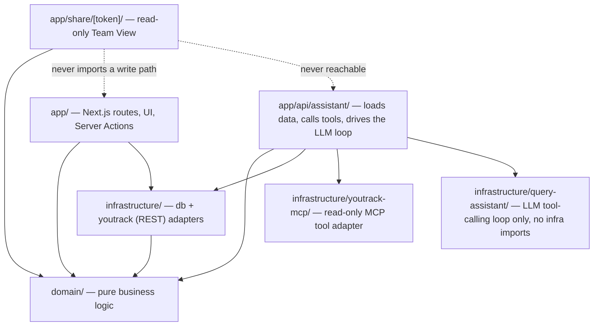
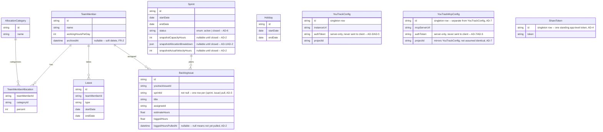

# Architecture Spine — Sprint & Velocity Planner

## Design Paradigm

**Lightweight Hexagonal (Ports & Adapters).** A pure `domain/` core holds every Capacity, Allocation, Leave/Holiday, and Velocity calculation as framework-free functions — no Next.js, Prisma, or MCP SDK imports. `app/` (Next.js routes, UI, Server Actions) and `infrastructure/` (database, YouTrack MCP client) are adapters that call *into* the domain; the domain never calls out to them. Chosen because the PRD reviewer pass already found real correctness bugs in this exact math (leave/holiday double-counting, a Dev-only-vs-all-category Capacity mismatch) — proof that letting this logic live in more than one place lets two independently-built call sites diverge. A single, pure, unit-testable domain core makes that divergence structurally impossible.



## Invariants & Rules

### AD-1 — Domain core owns all Capacity/Allocation/Leave/Velocity math

- **Binds:** FR-1–FR-15, FR-19
- **Prevents:** Two call sites (e.g. "close sprint" and "capacity breakdown") independently reimplementing a formula and diverging — already observed during PRD review; two domain functions independently reimplementing working-day/date-range/overlap logic and disagreeing at boundary cases (e.g. a leave range spanning a weekend, or a Holiday landing inside a Leave range); the FR-11/FR-12 Capacity figure and the FR-13 breakdown view silently drifting because they're computed by two unrelated code paths instead of one shared shape.
- **Rule:** Capacity, Allocation-%, Leave/Holiday reduction, and Velocity calculations live only in `domain/` as pure functions with zero Prisma/Next.js/MCP imports. Server Actions and Route Handlers call these functions; they never recompute the formulas inline. All date-range, working-day, and overlap/dedup logic (FR-9) lives in one shared function (`domain/calendar.ts`) that `leave.ts` and `capacity.ts` both call — neither reimplements it. `domain/capacity.ts` exports one `AllocationBreakdown` type; FR-11/FR-12's Capacity figure and FR-13's per-category breakdown are two projections of that same computed shape, never two independent calculations. Adding or removing a Team Member (FR-1, FR-2) also goes through `domain/allocation.ts`'s validate-then-persist path, consistent with every other roster mutation.

### AD-2 — Active Sprints compute live; closed Sprints snapshot

- **Binds:** FR-2, FR-11, FR-12, FR-14, FR-20–FR-23; Glossary Capacity/Velocity
- **Prevents:** A closed Sprint's historical numbers silently drifting when roster/allocation changes later (violates FR-2/FR-5's non-retroactivity rule); an active Sprint's numbers going stale (breaks FR-7's "recalculates immediately" requirement); a removed Team Member's historical contribution disappearing from closed-Sprint history (violates FR-2's "not retroactive deletion" rule); an implementer being unable to tell "0 hours logged" from "hours not yet pulled" (FR-14).
- **Rule:** An active Sprint's Capacity and Velocity are computed live from current roster/allocation/leave/holiday state on every read. Closing a Sprint (FR-23) snapshots the computed Capacity, the full `AllocationBreakdown` (AD-1), and the PM-confirmed Actual Velocity into persisted fields on the Sprint record (`snapshotCapacityHours`, `snapshotAllocationBreakdown`, `snapshotActualVelocityHours`). A closed Sprint's stored numbers are read directly and never recomputed. Removing a Team Member (FR-2) is a soft delete (`TeamMember.archivedAt` set, row never deleted) so closed-Sprint snapshots and past `BacklogIssue.assigneeId` references stay intact. A `BacklogIssue`'s logged-hours pull is tracked with a separate `loggedHoursPulledAt` timestamp distinct from `loggedHours` itself, so "0 hours, confirmed" is never confused with "not yet pulled."

### AD-3 — YouTrack REST integration is one server-only adapter, pull-based

- **Binds:** FR-16–FR-18, FR-21, FR-23; Non-Goals (no write-back)
- **Prevents:** A YouTrack outage breaking the ability to view an already-planned Sprint; the instance token leaking into the client bundle; a second call site bypassing the adapter with different assumptions (e.g. a different field-name config); two implementers disagreeing on whether a `BacklogIssue` row can be reused/mutated across multiple Sprints.
- **Rule:** All YouTrack access for backlog browsing, pulling issues, and logged-hours pull goes through one server-only adapter (`infrastructure/youtrack/`), called only from Server Actions/Route Handlers. `[AMENDED 2026-08-25]` This adapter calls YouTrack's own REST API directly (`fetch` + bearer token, `infrastructure/youtrack/rest-client.ts`) — it no longer wraps `@modelcontextprotocol/client`. The switch happened 2026-08-24: no MCP server was reachable in this environment to verify the original MCP-based implementation against, while YouTrack's REST API has a documented, directly-verifiable response shape. `@modelcontextprotocol/client` stays installed but is no longer imported by this adapter — see AD-7 for its new, separate use. Pulling an issue into a Sprint creates a new `BacklogIssue` row scoped to that specific `(sprintId, youtrackIssueId)` pair — including `title`, `estimateHours`, and `assigneeId` — never a single mutable row shared across every Sprint the issue has ever touched; `sprintId` is therefore never null. Viewing a planned Sprint never depends on YouTrack being reachable. The connection config (instance URL + auth token, FR-16) is stored server-side only in one `YouTrackConfig` singleton row — never sent to the client, consistent with AD-5. The adapter is invoked only at: backlog browse, pull-into-sprint, and Sprint close (logged-hours pull for FR-14). `[ADOPTED]` No sprint/agile-board object exists on the YouTrack surface — confirmed directly by the PM (not by enumerating a live server's tool list, which was the original verification path suggested in the PRD; the PM's direct confirmation is treated as sufficient); this app owns all Sprint/board state.

### AD-4 — Read-only Team View is structurally isolated

- **Binds:** FR-24
- **Prevents:** A future change accidentally wiring a mutation into the public, no-login view; two implementers disagreeing on whether the share token is per-Sprint (rotates every two weeks) or a single standing link.
- **Rule:** The shared Team View route (`app/share/[token]/`) may only import read-side domain/query functions. No module reachable from that route may import a write-capable Server Action. There is exactly one standing, unguessable app-level token (not one per Sprint) — the same link always shows whichever Sprint is currently active, so the PM never has to redistribute a new link every cycle. The route is gated by that token, not by login.

### AD-5 — No authentication system in v1

- **Binds:** all
- **Prevents:** Building login/session/user-account infrastructure the PRD explicitly excludes (Non-Goals); silently assuming an auth layer exists somewhere it doesn't.
- **Rule:** The app has no login, session, or user-account model. The PM's editing surface is protected only by network placement (trusted-network assumption). The Team View is additionally protected by an unguessable link token (FR-24, AD-4).

### AD-6 — Single active Sprint

- **Binds:** FR-20
- **Prevents:** Two Sprints being planned concurrently, which would make "the current Sprint" (used throughout FR-22, FR-24, and the Glossary) ambiguous and let the UI and the domain layer disagree about which Sprint is authoritative.
- **Rule:** At most one Sprint may be open at a time. Creating a new Sprint is rejected by the domain layer (not just the UI) while another is open — enforced with a DB constraint or an equivalent guard in the create-Sprint domain function.

### AD-7 — Query Assistant's MCP adapter is separate from the REST adapter, read-only tools only

- **Binds:** FR-25, FR-26
- **Prevents:** A future change smuggling a write-capable MCP tool into the assistant's reach because "the MCP server already supports it"; the assistant's MCP client being merged into or confused with `infrastructure/youtrack/` (AD-3), which is REST-only and has no MCP dependency anymore; two implementers disagreeing on whether the assistant may call arbitrary MCP tools versus only a fixed, reviewed allowlist.
- **Rule:** A new server-only adapter, `infrastructure/youtrack-mcp/`, is the only module permitted to import `@modelcontextprotocol/client` (kept installed since the 2026-08-24 REST migration for exactly this purpose — see AD-3's amendment). It exports one canonical allowlist constant (e.g. `READ_ONLY_TOOL_NAMES`) that both (a) filters the MCP server's `listTools()` result at registration and (b) is the exact set advertised to the LLM as callable tools — one shared source, so the two can never drift into exposing different tool sets. The allowlist covers only read/query-capable tools — issue search/read, time-tracking work-log read, project/user/article lookup. Write-capable tools the MCP server exposes (issue create/update, comment, tag, issue-link, article create/update) are never added to it, so no prompt, however phrased, can reach them. `infrastructure/youtrack-mcp/` is independent of `infrastructure/youtrack/` (AD-3) — two separate adapters, two separate connection configs (`YouTrackConfig` for REST vs. a new `YouTrackMcpConfig` singleton for the MCP server URL/token/project), even where both happen to point at the same YouTrack instance. `YouTrackMcpConfig` carries its own `projectId` field, mirroring `YouTrackConfig` — the MCP tools scope to a project the same way REST browsing does, and nothing assumes the two configs share a project id even if the PM sets them to match. Configuring this connection is new PM-facing surface with no existing story — flag it for the next epics/stories pass, alongside FR-16's existing "connect" flow. `[OPEN]` PRD Open Question 4 carries forward: confirm the live MCP server's actual tool list matches this assumed read/write split before the allowlist is implemented against it.

### AD-8 — Query Assistant composition: code inserts every figure, not the model; wiring stays at the app/ layer

- **Binds:** FR-25, FR-27, FR-28
- **Prevents:** The assistant free-generating a plausible-looking number instead of executing a real query — a hallucination risk no other FR carries, and one no prompt instruction alone can close (reviewer gate flagged this: an instruction is not an enforcement mechanism); `infrastructure/query-assistant/` importing `infrastructure/youtrack-mcp/` directly — an infra→infra import with zero precedent in this codebase (both existing adapters, `db/` and `youtrack/`, are only ever composed by `app/`, never by each other); an implementer reaching for `domain/`'s pure functions without realizing they need Sprint/roster/allocation data loaded first — `domain/capacity.ts` etc. take already-loaded records as arguments (AD-1: zero Prisma imports), they don't fetch anything themselves; an implementer always computing Capacity/Velocity live even for a closed Sprint, contradicting AD-2's snapshot-once-closed rule while remaining "grounded" by this AD's letter; the assistant's route becoming reachable from `app/share/[token]/`, which would silently widen AD-4's read-only, no-write-surface guarantee for that anonymous route; a YouTrack-sourced figure and a domain-computed figure being blended into one answer with no indication which is which; two implementers picking incompatible response shapes for the same streaming route.
- **Rule:** `infrastructure/query-assistant/` holds only the LLM tool-calling loop and is composed with its data sources by injection, never by importing another `infrastructure/` module — the same pattern `domain/youtrack.ts`'s `listBacklogIssues(configRepo, issuesPort)` already uses. The actual wiring — loading Sprint/roster/allocation/leave records via `infrastructure/db/` repositories, calling `domain/`'s pure compute functions (`capacity.ts`, `velocity.ts`, `leave.ts`, `allocation.ts`) with that data, and calling `infrastructure/youtrack-mcp/`'s registered tools (AD-7) — happens in `app/api/assistant/route.ts`, mirroring the existing "Server Actions are thin: validate input, call domain, call repositories" convention. For an **active** Sprint this means the live compute path (AD-2); for a **closed** Sprint the assistant reads the persisted `snapshotCapacityHours`/`snapshotAllocationBreakdown`/`snapshotActualVelocityHours` fields instead of recomputing — never silently diverging from what every other screen already shows for that Sprint. **Grounding is enforced by construction, not by instruction:** the LLM only ever selects which tool/domain call to make and drafts the surrounding prose; every number or fact in the final response is substituted in by app code from that call's actual return value, never typed by the model itself — there is no code path where the model's own token stream can produce a figure unmediated by a real return value. The response attributes each substituted figure to its source (YouTrack MCP vs. this app's computation), never presenting a blended number with no source. A tool-call failure (MCP unreachable, timeout) or an ungroundable question surfaces as a plain inline statement in the response — the same clear-error posture as AD-3/FR-16 — never a partial silent answer or an unhandled exception. The route streams a small tagged-union protocol (e.g. `{type:"text",delta}` / `{type:"source",...}` / `{type:"error",message}`), the streaming equivalent of the app's `{ok,data}|{ok,error}` Server Action convention — not a bare token stream with an ad hoc error shape. `app/api/assistant/route.ts` is wired only into the PM's own editing UI (`app/(pm)/`) — never imported by or reachable from `app/share/[token]/` (AD-4); there is no session/auth model backing this (AD-5 still holds unmodified), so "PM-only" here means route-tree reachability, the same guarantee AD-4 already relies on, not a login or session concept.
- **`[RESOLVED]`** Roster, allocation, leave, and YouTrack data are sent to the LLM provider (Anthropic) as-is, unredacted. `[ADOPTED]` PM decision: this is internal business data for a single team's own tool, not customer/health/financial PII; Anthropic's commercial API doesn't train on customer data by default. No pseudonymization layer is built.

## Consistency Conventions

| Concern | Convention |
| --- | --- |
| Naming (entities, files, interfaces, events) | Prisma models mirror PRD §3 Glossary terms exactly — `TeamMember`, `AllocationCategory`, `Leave`, `Holiday`, `Sprint`, `BacklogIssue` — one-to-one, no synonyms introduced anywhere in code. |
| Data & formats (ids, dates, error shapes) | IDs: Prisma default `cuid()`. Dates: Postgres `date` (no time-of-day) — the whole domain operates at day granularity (leave, holidays, sprint boundaries). Date ranges (Leave, Holiday, Sprint) are inclusive on both `startDate` and `endDate`. `Sprint.status` is a Prisma enum (`active`, `closed`), never a free string, so AD-6's single-active-Sprint guard can't be bypassed by an unrecognized status value. Server Actions return a discriminated result (`{ok:true,data}` \| `{ok:false,error}`) rather than throwing, so the UI has one uniform error-handling shape. |
| State & cross-cutting (mutation, errors, logging, config, auth) | All writes to TeamMember/Allocation/Leave/Holiday/Sprint go through `domain/`'s validate-then-persist functions — never a raw Prisma call from a route or component (AD-1). No auth/session middleware (AD-5). Logging is plain server/console logs — no observability stack (see Deferred). |

## Stack

*Verified current via web research 2026-08-12 (re-verified independently at Reviewer Gate).*

| Name | Version |
| --- | --- |
| Next.js | 16.3.x (App Router, Turbopack default) |
| React | 19.2 |
| TypeScript | latest stable |
| Prisma | 7.x |
| Supabase (Postgres) | free tier — note: free projects auto-pause after 7 days of inactivity, relevant once always-on hosting (Deferred) is revisited |
| `@modelcontextprotocol/client` | `^2.0.0`, already installed. `[AMENDED 2026-08-25]` No longer used by `infrastructure/youtrack/` (AD-3, now REST) — its live use is now `infrastructure/youtrack-mcp/` (AD-7), the Query Assistant's read-only tool adapter. |
| Tailwind CSS | latest (create-next-app default) |
| Anthropic Claude (Messages API, tool use) | `[ASSUMPTION]` a small/fast current model (e.g. Claude Haiku 4.5) — Query Assistant's LLM provider; low-volume internal tool, no need for a larger model. Confirm with PM; swappable behind `infrastructure/query-assistant/`. |

## Structural Seed

```text
app/
  (pm)/                    # PM's editing UI — roster, leave, sprint planning
  share/[token]/           # read-only Team View — read-side only (AD-4); never imports api/assistant
  api/
    assistant/route.ts     # Query Assistant entry point (AD-8) — thin, PM UI only
  actions/                 # Server Actions — thin: validate input, call domain, call repositories
domain/                    # pure business logic — zero framework/DB/MCP imports (AD-1)
  allocation.ts            # FR-1, FR-2, FR-3, FR-4, FR-5
  leave.ts                 # FR-6, FR-7, FR-8, FR-9, FR-10 (calls calendar.ts)
  calendar.ts              # shared working-day/date-range/overlap logic — used by leave.ts and capacity.ts (AD-1)
  capacity.ts              # FR-11, FR-12, FR-13 (calls calendar.ts, exports AllocationBreakdown)
  velocity.ts              # FR-14, FR-15
  sprint.ts                # FR-19, FR-20, FR-21, FR-22, FR-23 (AD-2, AD-6)
infrastructure/
  db/                      # Prisma client + one repository per aggregate
  youtrack/                # REST adapter (AD-3) — no MCP import as of 2026-08-25
  youtrack-mcp/            # MCP client adapter (AD-7) — the only module importing @modelcontextprotocol/client; read-only tool allowlist
  query-assistant/         # LLM + tool-calling orchestration (AD-8) — calls youtrack-mcp/ and domain/
prisma/
  schema.prisma
```



*Holiday has no Sprint foreign key — it's company-wide and evaluated against whichever Sprint's date range it falls within at Capacity-computation time (AD-1), not tied to one Sprint by reference. `YouTrackConfig`, `YouTrackMcpConfig`, and `ShareToken` are standalone singleton tables, not related to any other entity.*

## Capability → Architecture Map

| Feature (PRD §4) | Lives in | Governed by |
| --- | --- | --- |
| 4.1 Team Roster & Allocation | `domain/allocation.ts`, `app/(pm)/roster` | AD-1, AD-2 (soft delete) |
| 4.2 Leave & Holidays | `domain/leave.ts`, `domain/calendar.ts`, `app/(pm)/leave` | AD-1 |
| 4.3 Capacity & Velocity Calculation | `domain/capacity.ts`, `domain/calendar.ts`, `domain/velocity.ts` | AD-1, AD-2 |
| 4.4 YouTrack Integration (via REST) | `infrastructure/youtrack/` | AD-3 |
| 4.5 Sprint Planning | `domain/sprint.ts`, `app/(pm)/sprint` | AD-1, AD-2, AD-6 |
| 4.6 Read-Only Team View | `app/share/[token]/` | AD-4, AD-5 |
| 4.7 Conversational Query & Reporting Assistant | `infrastructure/youtrack-mcp/`, `infrastructure/query-assistant/`, `app/api/assistant/` | AD-7, AD-8 |

## Deferred

- **Always-on hosting / deployment topology.** v0 runs the Next.js app on the PM's own laptop (Supabase hosts only the database, regardless of where the app runs). This is a known, accepted limitation, not an oversight: FR-24's "reachable anytime" is explicitly not met in v0 — the PRD itself has been updated (`[NOTE FOR PM]` on FR-24 and §6.1) to say so, rather than the PRD and this spine silently disagreeing. Revisit hosting (e.g. Vercel's free tier for the app, with Vercel Deployment Protection replacing the trusted-network assumption for the PM's edit surface) before the Team View needs to actually go live for the team.
- **Authentication/login system.** Explicitly out of scope (PRD Non-Goals). Revisit only if deployment ever needs to leave a trusted network.
- **Multi-team / multi-project support.** Out of scope (PRD Non-Goals).
- **Observability/logging stack.** Plain server logs are sufficient at this scale; revisit if usage grows beyond one team.
- **CI/CD pipeline.** Not addressed — small enough to add ad hoc; revisit if story cadence justifies it.
- **Test-runner choice (Vitest/Jest/etc.).** AD-1's framework-independent domain core is what matters architecturally; the specific runner is a low-stakes implementation detail left to the builder.
- **Live MCP tool-list verification (AD-7, PRD Open Question 4).** The read/query-vs-write tool split assumed for `infrastructure/youtrack-mcp/`'s allowlist is sourced from JetBrains' documentation, not yet confirmed by enumerating the PM's actual reachable MCP server's tool list. Do this before implementing Story work for FR-25/FR-26 — a one-time check, not an ongoing dependency.
- **LLM provider/model final confirmation.** Stack table names Anthropic Claude (Messages API) as `[ASSUMPTION]` — cheap to swap since it's isolated behind `infrastructure/query-assistant/`, but not yet PM-confirmed.
